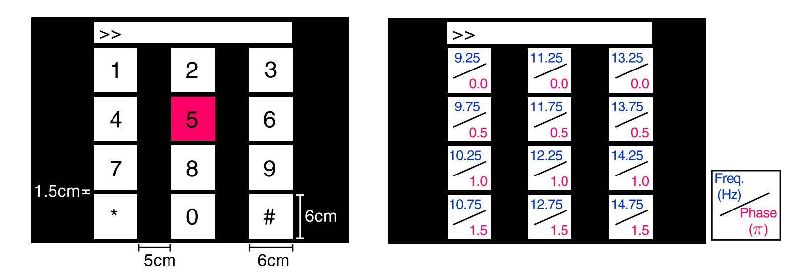

# SSVEP_Classifier_Demo
We designed three python demos for SSVEP Classifier

>+ utils/cca_utils.py
>+ utils/vae_utils.py
>+ cca_ssvep.ipynb  Classification Using Canonical Correaltion Analysis (CCA)
>+ cnn_ssvep.ipynb  Classification Using Complex Spectrum Features and Convolutional Neural Networks (C-CNN)
>+ vae_ssvep.ipynb  Classification Using Variational Autoencoder（VAE）and Convolutional Neural Networks (VAE-CNN) 

# Dataset
Dataset Reference: 12-Class publicly available SSVEP EEG Dataset Dataset.

The following is implemented on a 12-Class publicly available SSVEP EEG Dataset

Dataset Download URL: https://github.com/mnakanishi/12JFPM_SSVEP/tree/master/data

## File format
Each .mat file has a four-way tensor electroencephalogram (EEG) data for each subject.
Please see the reference paper for the detail.

[Number of targets, Number of channels, Number of sampling points, Number of trials] = size(eeg)

>+ cdot Number of targets : 12
>+ Number of channels : 8
>+ Number of sampling points : 1114
>+ Number of trials : 15
>+ Sampling rate [Hz] : 256

The order of the stimulus frequencies in the EEG data:
[9.25, 11.25, 13.25, 9.75, 11.75, 13.75, 10.25, 12.25, 14.25, 10.75, 12.75, 14.75] Hz
(e.g., eeg(1,:,:,:) and eeg(5,:,:,:) are the EEG data while a subject was gazing at the visual stimuli flickering at 9.25 Hz and 11.75Hz, respectively.)

The onset of visual stimulation is at 39th sample point, which means there are redundant data for 0.15 [s] before stimulus onset.

# Result
We tested the above three methods from EEG data of ten people.

|  | S1 | S2 | S3 | S4 | S5 | S6 | S7 | S8 | S9 | S10 | Overall 
| :-----| :----: | :----: | :----: | :----: | :----: | :----: | :----: | :----: | :----: | :----: | :----: |
|CCA | 29.16% | 26.25% | 59.44% | 80.27% | 52.36% | 87.22% | 69.17% | 96.67% | 66.38% | 65.27% | 63.22%|
|C-CNN | 77.77% | 56.80% | 94.99% | 98.19% | 99.72% | 99.72% | 94.16% | 99.16% | 97.36% | 89.86% | 90.77% |
|VAE-CNN | 99.86% | 99.44% | 99.86% | 99.72% | 100% | 97.91% | 100% | 100% | 99.30% | 99.72% | 99.58%|

# Reference
https://github.com/nikk-nikaznan/SSVEP-Neural-Generative-Models

https://github.com/aaravindravi/Brain-computer-interfaces
